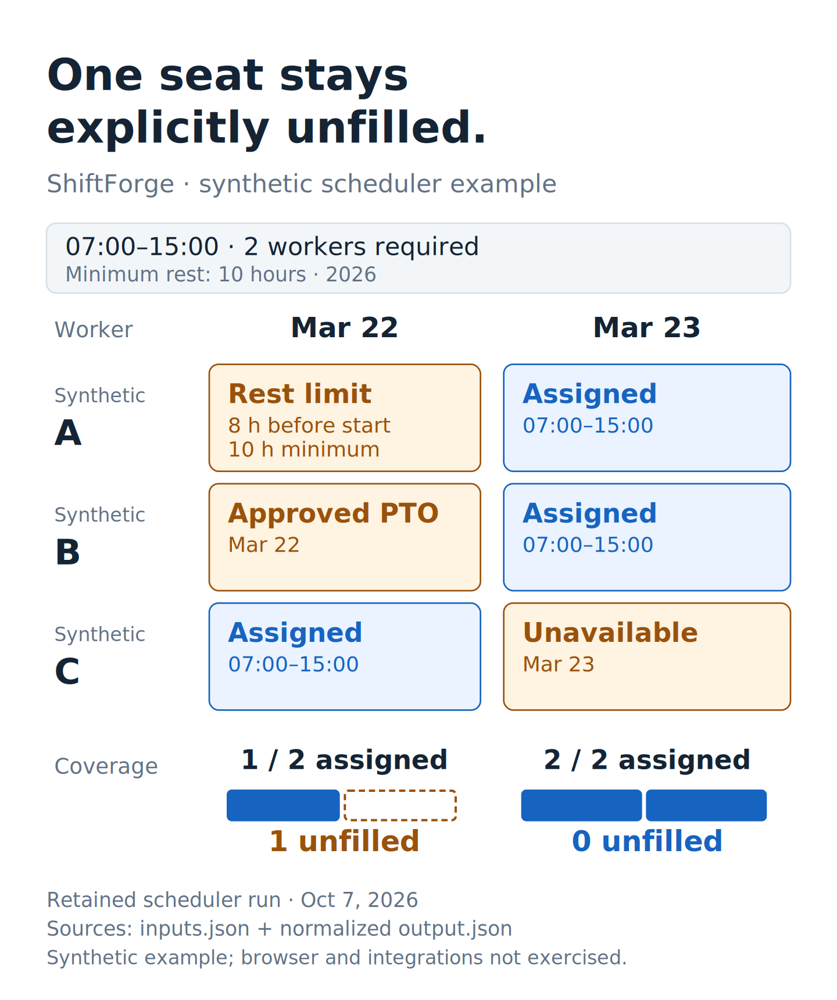

# Tucker Vana

**Mechanical engineer · Manufacturing, cryogenic hardware, equipment integration, and troubleshooting**

I’m a Colorado School of Mines mechanical engineering graduate, cum laude. My experience includes production startup, cryogenic systems, fabrication, CNC equipment, and technical operations. My independent projects extend that work into software, Linux systems, and public-data analysis.

Project pages describe what I did, why, and what evidence is available.

[Experience](EXPERIENCE.md) · [Capabilities with examples](CAPABILITIES.md) · [Complete work index](WORK_INDEX.md) · [Supporting records](artifacts/README.md)

## Featured work

| Work | What to look for |
|---|---|
| [Production startup — Pouch Factory](projects/production-startup.md) | Engineering planning, CAD/calculations, utilities, and hands-on line build and operation |
| [Cryogenic hardware — Maybell Quantum](projects/cryogenic-hardware.md) | Lake Shore/LattePanda instrumentation and gas-valve controls, manufacturing trials, and a public APS presentation record |
| [Fabrication and CNC](projects/fabrication-cnc.md) | Waterjet pump rebuild: consistent cutting restored and production resumed in three working days |

## Inspect the work

[Browse the technical figures](artifacts/README.md#technical-figures) · [Read their evidence and scope](docs/FIGURE_GUIDE.md) · [Prepared post drafts](posts/README.md)

Preview the waterjet repair: cutting fault, pump inspection, production restart

The drawing is reconstructed from my repair account. [Inspect the supporting record](artifacts/fabrication-cnc/README.md).

Preview SCAMP solar fault isolation: installed path versus direct-panel test

The drawing explains the diagnostic comparison. [Inspect the account and installation photograph](artifacts/mobile-power/README.md).

Preview the transit analysis: three measurable scheduled-frequency changes

The chart is calculated from the retained public-source table. [Inspect the data and calculation](artifacts/colorado-transit-award-service/frequency-comparison.md).

Preview ShiftForge: constraints, assignments, and an explicit unfilled seat

Generated from retained synthetic inputs and actual normalized scheduler output. [Inspect the inputs, output, and execution scope](artifacts/shiftforge/README.md).

## Additional work

VanaHR, Argus Audit, ShiftForge, and Lavatune were implemented by AI coding agents under my direction.

| Work | Focus |
|---|---|
| [VanaHR](projects/vanahr.md) | Onboarding application; recovery planning and owner-reported rollback validation |
| [Lavatune](projects/lavatune.md) | Software experiment built through AI coding agents; public implementation and change history |
| [Argus Audit](projects/argus-audit.md) | On-device iOS photo analysis and controls around destructive operations |
| [ShiftForge](projects/shiftforge.md) | Scheduling constraints and application integrations |
| [CodexDeck](projects/codexdeck.md) | Reproducible Linux workstation configuration and recovery |
| [RV power systems](projects/mobile-power.md) | Sprinter house power and SCAMP solar installation and fault isolation |
| [Colorado budget research](projects/colorado-budget-research.md) | Reproducible analysis, source reconciliation, and measurement limits |
| [Mines capstone](projects/mines-capstone.md) | Mechanical engineering on a four-rotor wildfire-drone team |

## Public technical record

The American Physical Society lists me as presenter and coauthor of **Scalable Flexible Coaxial Ribbon Cables for High-Density Quantum Wiring (Part II)** at the 2023 March Meeting. [View the APS record](https://meetings-archive.aps.org/mar/2023/q72/5/).

## Background

B.S. Mechanical Engineering, Colorado School of Mines, December 2021. Cum laude; 3.65 GPA.

These pages summarize selected professional and independent work. Private source documents and project code are not included.
