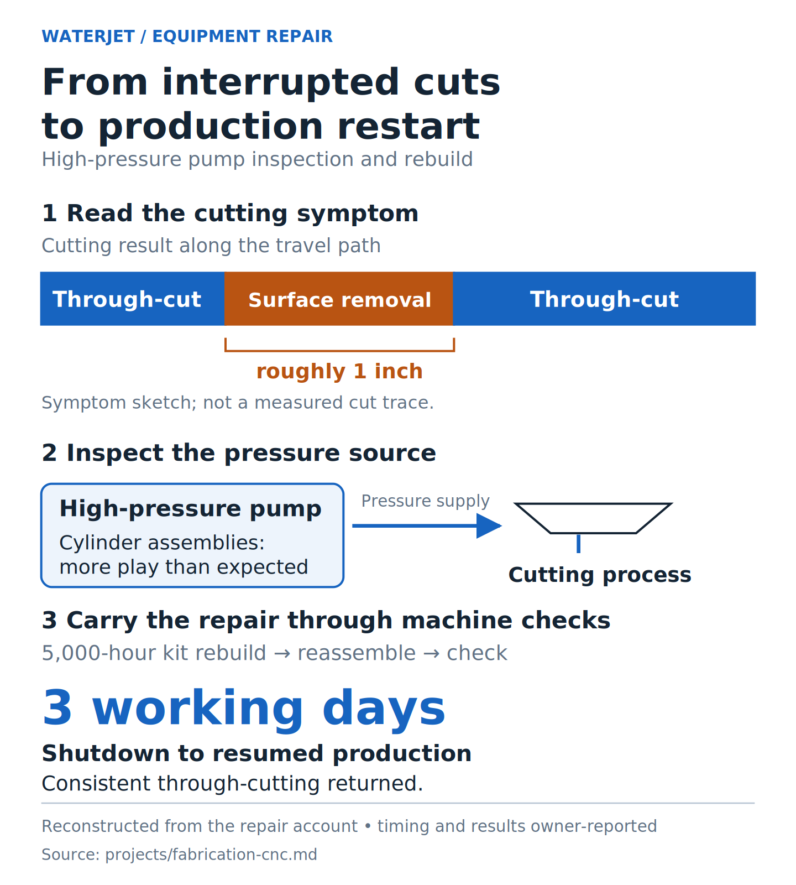
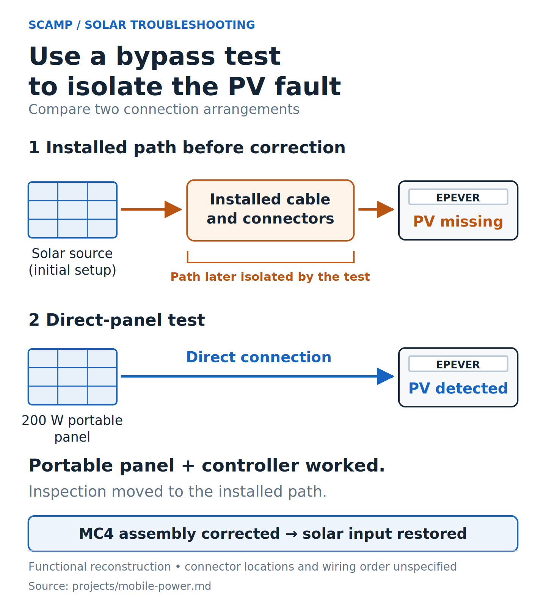
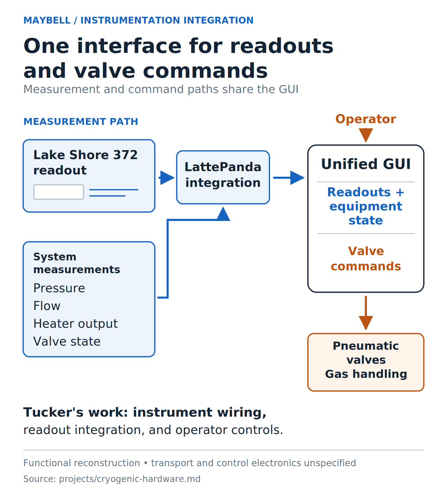
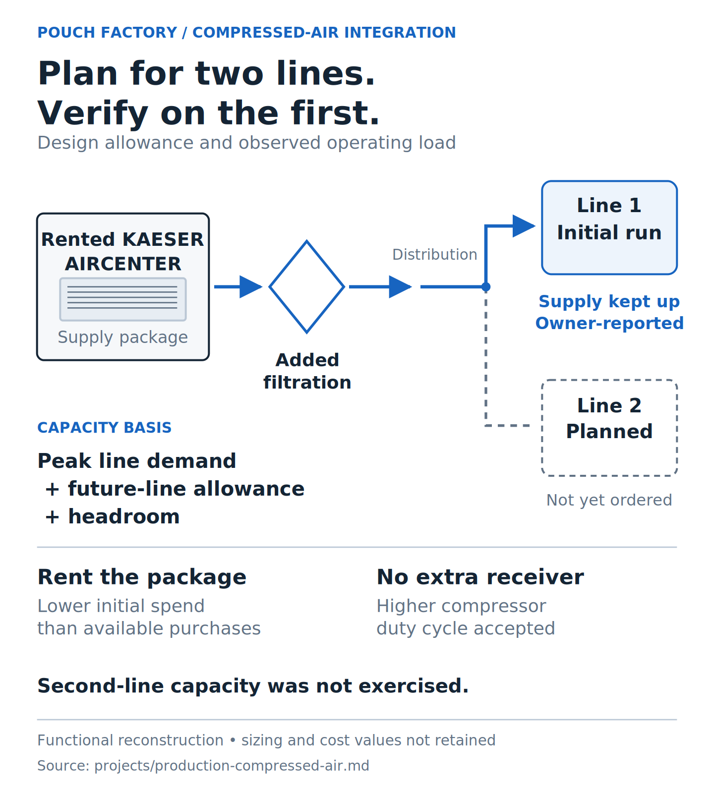
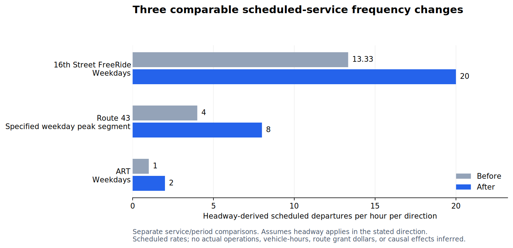

# Supporting work records

## Technical figures

Open a preview to inspect the figure. Each case links to its underlying account or data and both export formats.

Waterjet repair: interrupted cutting and upstream pump inspection

Reconstructed from the repair account; timing and results are owner-reported.

[Supporting record](fabrication-cnc/README.md) · [PNG](fabrication-cnc/waterjet-repair-sequence.png) · [SVG](fabrication-cnc/waterjet-repair-sequence.svg)

SCAMP: the direct-panel test isolates the installed path

Functional reconstruction of the troubleshooting account; the source does not specify the initial panel connection.

[Supporting record](mobile-power/README.md) · [PNG](mobile-power/scamp-pv-fault-isolation.png) · [SVG](mobile-power/scamp-pv-fault-isolation.svg)

Maybell: readouts and valve commands share one interface

Functional reconstruction; acquisition interfaces and control electronics are unspecified.

[Supporting record](cryogenic-hardware/README.md) · [PNG](cryogenic-hardware/instrumentation-flow.png) · [SVG](cryogenic-hardware/instrumentation-flow.svg)

Compressed air: expansion allowance and first-line operation

Functional reconstruction; first-line operation is reported and second-line capacity was not exercised.

[Supporting record](production-compressed-air/README.md) · [PNG](production-compressed-air/compressed-air-decisions.png) · [SVG](production-compressed-air/compressed-air-decisions.svg)

Transit: compare the three complete headway pairs

Calculated from the retained public-source crosswalk; the rates describe announced schedules.

[Supporting record](colorado-transit-award-service/README.md) · [PNG](colorado-transit-award-service/scheduled-frequency.png) · [SVG](colorado-transit-award-service/scheduled-frequency.svg)

## Project records

| Work | Inspect |
|---|---|
| Pouch Factory compressed air | [Decision figure and source status](production-compressed-air/README.md) |
| Maybell instrumentation | [Measurement and operator-control figure](cryogenic-hardware/README.md) |
| Waterjet repair | [Inspection, rebuild, and return-to-production sequence](fabrication-cnc/README.md) |
| SCAMP power | [PV fault-isolation figure and installed monitor photo](mobile-power/README.md) |
| VanaHR | [Recovery paths and evidence](vanahr/README.md) |
| Argus Audit | [Review-to-deletion boundary](argus-audit/README.md) |
| ShiftForge | [Executed synthetic fixture and retained checks](shiftforge/README.md) |
| Lavatune | [Capture and resource ownership](lavatune/README.md) |
| CodexDeck | [Rebuild and acceptance sequence](codexdeck/README.md) |
| Colorado transit research | [Award/service trace](colorado-transit-award-service/README.md) · [Frequency comparison](colorado-transit-award-service/frequency-comparison.md) |

Account-based physical diagrams are labeled as reconstructions. Software records distinguish source inspection, synthetic execution, and live operation. The private implementations remain in their original repositories.

[Prepared posts and downloadable figures](../posts/README.md) pair two cases with copy, captions, alt text, and PNG exports.

[How to read the revised figures and their evidence](../docs/FIGURE_GUIDE.md).
