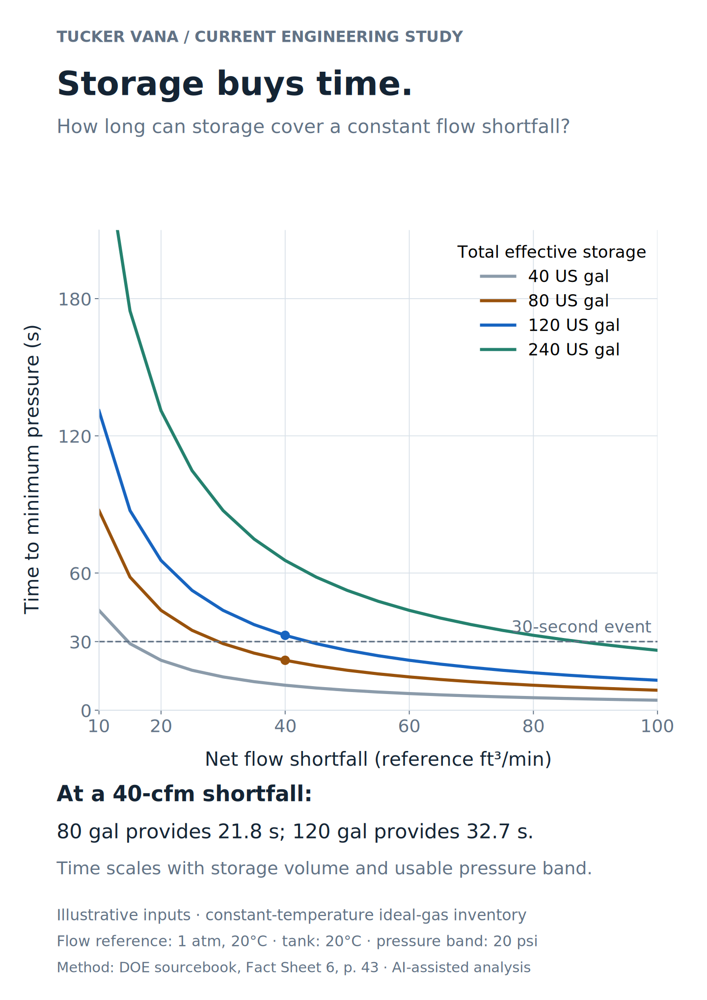
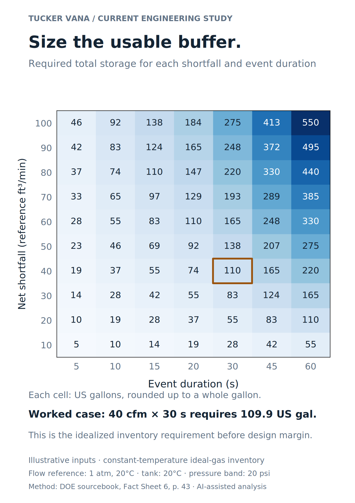
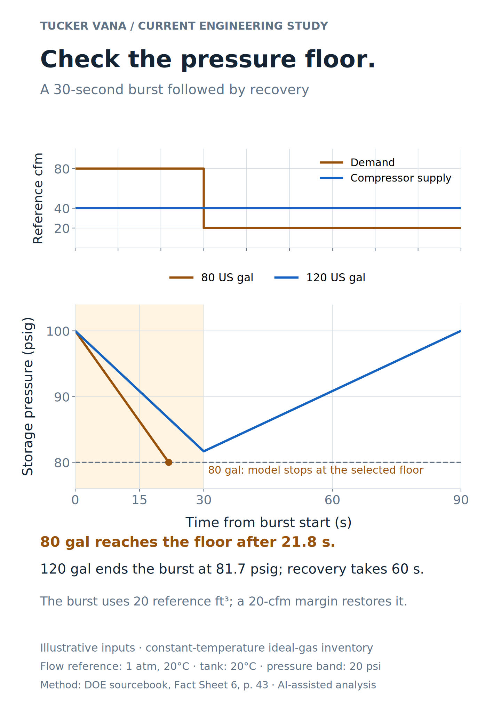

# Compressed-air storage: a worked engineering study

[Download the three-page analysis PDF](air-storage-analysis.pdf) · [Inputs](inputs.json) · [Calculated results and checks](results.json)

This is new AI-assisted portfolio analysis, prepared under Tucker Vana's direction. It uses illustrative inputs and the DOE storage-sizing method. It develops a quantitative follow-up to the [Pouch Factory air-supply account](../../projects/production-compressed-air.md); it does not reproduce or validate that facility's sizing.

## Inspect the three figures

| Figure | Question | Exports | Retained numbers |
|---|---|---|---|
| Buffer duration | How long does each storage volume cover a flow shortfall? | [PNG](buffer-duration.png) · [SVG](buffer-duration.svg) · [PDF](buffer-duration.pdf) | [Buffer-time CSV](buffer-times.csv) |
| Required storage | What total volume meets a stated event time and flow deficit? | [PNG](required-storage.png) · [SVG](required-storage.svg) · [PDF](required-storage.pdf) | [Sizing CSV](required-volumes.csv) |
| Pressure and recovery | When does pressure reach the floor, and how long does replenishment take? | [PNG](pressure-recovery.png) · [SVG](pressure-recovery.svg) · [PDF](pressure-recovery.pdf) | [Pressure-trace CSV](pressure-trace.csv) |

<details>
<summary>Buffer-duration curves</summary>



</details>

<details>
<summary>Required-volume matrix</summary>



</details>

<details>
<summary>Demand, storage pressure, and recovery</summary>



</details>

## Worked case

All flows use **one explicit reference basis: 101,325 Pa and 20°C**. Receiver temperature is held at 20°C. The pressure band is 100 to 80 psig. Storage volume means total effective system storage, including the volume represented by receivers and connected piping.

| Input or result | Value |
|---|---:|
| Compressor supply during the event | 40 reference ft³/min |
| Burst demand | 80 reference ft³/min |
| Burst duration | 30 seconds |
| Net shortfall | 40 reference ft³/min |
| Air inventory needed for the burst | 20 reference ft³ |
| Required total storage under the model | 109.933 US gal |
| 80-gal time to the floor | 21.831 seconds |
| 120-gal time to the floor | 32.747 seconds |
| 120-gal pressure at burst end | 81.678 psig |
| Post-burst demand / net recovery margin | 20 / 20 reference ft³/min |
| Time to replenish the burst inventory | 60 seconds |

The 80-gal pressure trace ends at the chosen minimum; operation below that floor is outside the model. The 120-gal trace completes the burst and replenishes the inventory. Storage covers a finite transient. A positive flow margin after the event supplies the recovery.

## Method and units

The [DOE sourcebook, third edition, Fact Sheet 6, printed page 43](https://www.energy.gov/sites/default/files/2016/03/f30/Improving%20Compressed%20Air%20Sourcebook%20version%203.pdf#page=48) gives the receiver inventory relationship using event time, free-air flow, reference pressure, and usable pressure difference. Flow supplied during the event is subtracted from demand.

The implementation expresses that relationship as:

```text
V_us_gal = (Q_shortfall_ref_cfm × t_seconds / 60)
           × (P_reference_psia / pressure_band_psi)
           × (T_receiver_K / T_reference_K)
           × (1728 / 231)
```

The temperature factor follows from ideal-gas mass inventory. The reference pressure defines the volumetric-flow basis; it is not an assumed Colorado site pressure. Gauge pressures are used only as a difference. US gallons, cubic feet, seconds, and minutes are converted explicitly.

The model holds receiver temperature and flows constant. Pipe, filter, and regulator losses; compressor controls; transient cooling; and energy/cost are outside its scope. The required volume is an idealized inventory threshold before design margin. Historical Pouch capacity, installed receiver volume, operating pressure, and duty-cycle results are not inferred.

## Reproduce and check

[Model and record generator](../../scripts/air_storage_model.py) · [Figure and PDF generator](../../scripts/air_storage_figures.py)

The retained result includes 13 passed mathematical checks: SI/US agreement, a numerical reference case, volume/time inversion, scaling, zero-deficit behavior, temperature dependence, air-inventory balance, and trace endpoints. CI recomputes the tables and checks all SVG/PNG/PDF exports against fresh generation.

```bash
python3 scripts/air_storage_model.py --write-records
python3 scripts/air_storage_model.py --check
python3 scripts/render-portfolio.py --write-assets
python3 scripts/render-portfolio.py --check
python3 scripts/verify-portfolio.py
```

Use this as an analytical supplement for manufacturing, equipment-integration, or test roles. Describe it as a current AI-assisted study. The historical case sheet remains the account of the paid work.
