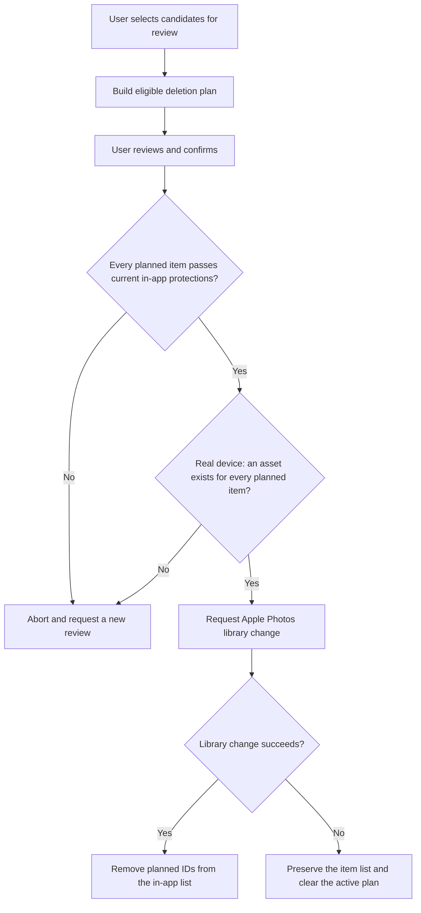

# Argus Audit: review-to-deletion boundary

Tucker directed development through AI coding agents. The supporting example is keeping a destructive operation tied to the reviewed set of photos. [Project account](../../projects/argus-audit.md).

The inspected implementation excludes ignored items and designated keepers from a deletion plan. Automatically selected favorites and exact duplicates need explicit manual selection. Cluster protection retains a member if the candidate set would remove the entire cluster. Before a real-device library change, the code rechecks the plan against current in-app protections and requires an asset for every planned item.

The simulator branch reconciles success without requesting the real Photos deletion operation. A simulator demonstration therefore has a different scope from a real-device library-change check. Detector accuracy and physical-device readiness are not established by this source inspection.

Source review: private repository revision `e6ae71beae88f77ff6031b18e0da05fec7e7ccb1`, `PhotoScannerViewModel.swift` plan/execute/reconcile methods. This is a summarized code-flow record; private source code and personal photos are not reproduced.
