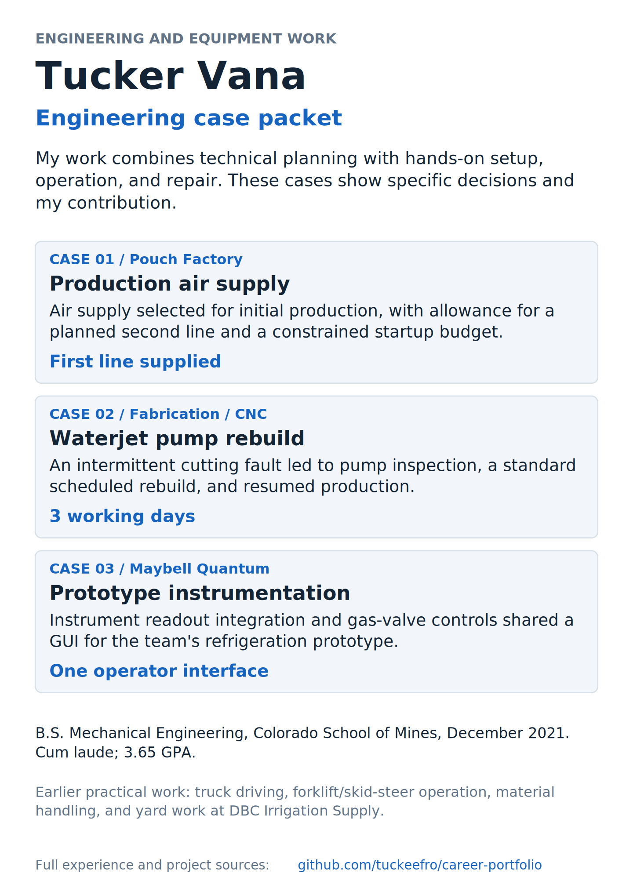
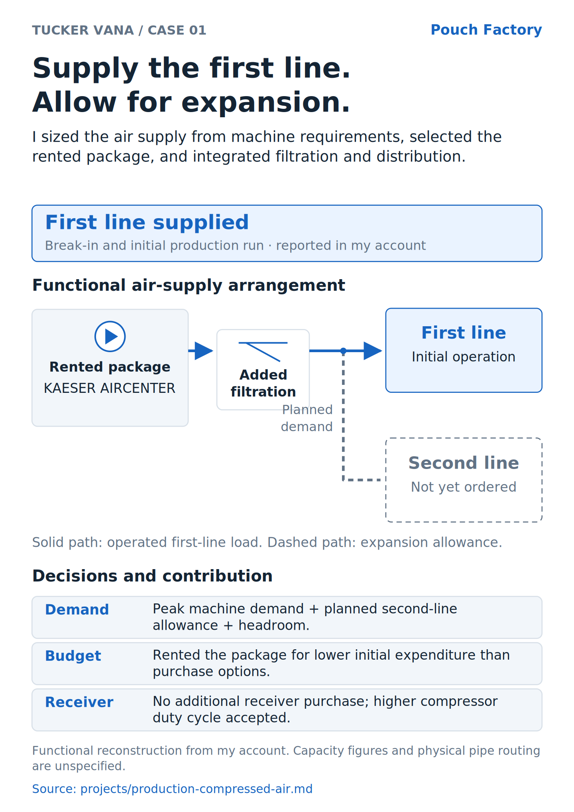
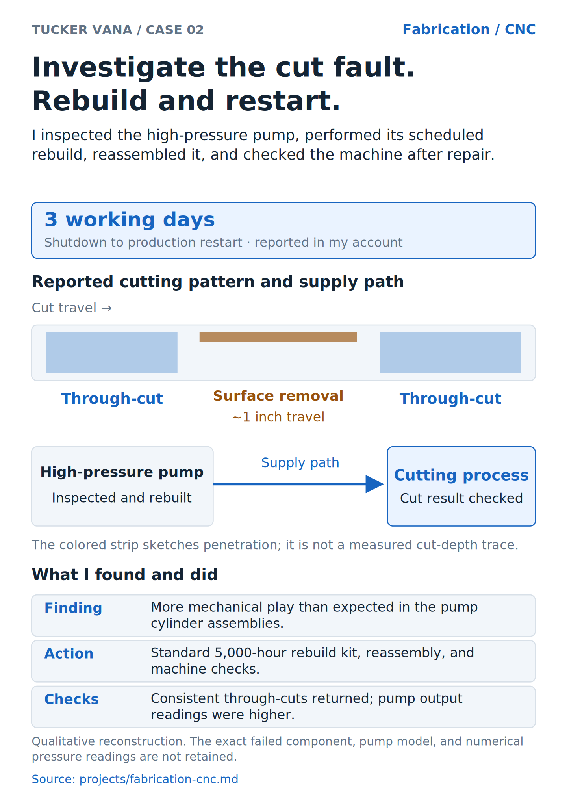

# Tucker Vana: engineering case packet

[Download the four-page PDF](engineering-portfolio.pdf).

The packet leads with three selected examples of my paid mechanical and equipment work. The overview identifies the cases; each case sheet puts my contribution, a technical diagram, the decision or repair, and the reported result on one page.

| Page | Case | Download |
|---|---|---|
| 1 | Engineering and equipment work overview | [PDF](00-overview.pdf) · [PNG](00-overview.png) · [SVG](00-overview.svg) |
| 2 | Pouch Factory: production air supply | [PDF](01-air.pdf) · [PNG](01-air.png) · [SVG](01-air.svg) |
| 3 | Waterjet: pump inspection, rebuild, and restart | [PDF](02-waterjet.pdf) · [PNG](02-waterjet.png) · [SVG](02-waterjet.svg) |
| 4 | Maybell: readouts and operator valve commands | [PDF](03-maybell.pdf) · [PNG](03-maybell.png) · [SVG](03-maybell.svg) |

Preview the overview

Preview the Pouch Factory case sheet

Preview the waterjet case sheet

Preview the Maybell case sheet

## Source and scope

These are account-based case sheets. They explain the work described in the retained project pages; they are functional reconstructions rather than original employer drawings. The air sheet distinguishes operated load from expansion allowance. The waterjet strip sketches the reported cut pattern; duration and return-to-production results are reported in my account. The Maybell drawing identifies readout and operator-command roles without specifying wiring protocols or driver electronics.

[Air-system account](../../projects/production-compressed-air.md) · [Production startup](../../projects/production-startup.md) · [Waterjet account](../../projects/fabrication-cnc.md) · [Maybell account](../../projects/cryogenic-hardware.md).

The [case records](case-records.json) retain source excerpts alongside the diagram copy. The generator checks that those excerpts still appear in the linked accounts. SVGs, PNGs, and PDFs are exported from the same page sources; CI checks their retained exports. The combined PDF contains four A4 pages.

## Use the packet

For manufacturing/equipment-integration applications, lead with the air-system sheet. For maintenance, equipment service, or CNC/shop work, lead with the waterjet sheet. For instrumentation, prototype, and test-integration work, lead with Maybell.

[Application bullets and interview stories](../../docs/CAREER_PLAYBOOK.md) · [Smallest useful firsthand details](../../docs/OWNER_INPUTS.md) · [Full work history](../../EXPERIENCE.md) · [All projects](../../WORK_INDEX.md).
