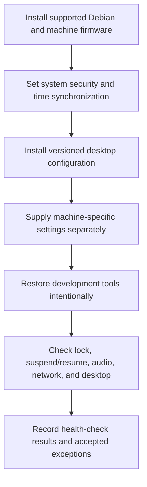

# CodexDeck: rebuild and acceptance sequence

The private repository's rebuild procedure and verification script were inspected at revision `7e25c02f6bd438d63d60b16f412f55bd601ad5d8`. This supporting record shows the procedure and acceptance boundaries. [Project account](../../projects/codexdeck.md).

The rebuild procedure backs up existing desktop files before replacement and keeps machine-specific configuration separate. Its acceptance checklist covers time synchronization, updates, failed services, login/lock behavior, suspend/resume, required hardware, and health checks.

The repository verifier checks for forbidden credential/disk-image artifacts, possible embedded credentials, machine-specific paths/addresses, shell syntax, and existing unit tests. These are inspected controls, not a successful restoration result. This review did not rebuild a machine or execute the shell verifier.

Sources inspected: `docs/REBUILD.md` and `scripts/verify-repo.sh`. Private configuration and machine state are not reproduced.
