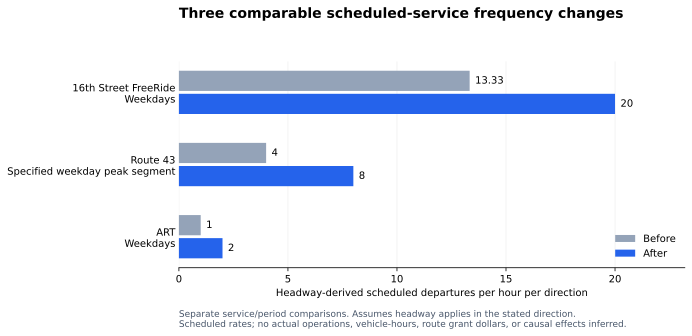

# Scheduled-service frequency comparison

Only three rows in the retained crosswalk have both before and after headways. Their rates follow `departures per hour = 60 / headway in minutes`.

| Service and period | Before headway | After headway | Before departures/hour | After departures/hour | Change |
|---|---:|---:|---:|---:|---:|
| 16th Street FreeRide, weekdays | 4.5 min | 3 min | 13.33 | 20 | +50% |
| Route 43, specified weekday peak segment | 15 min | 7.5 min | 4 | 8 | +100% |
| ART, weekdays | 60 min | 30 min | 1 | 2 | +100% |

The unit is an implied scheduled rate per hour per direction, assuming the stated headway applies in that direction. These are separate service/period comparisons, not a sum across routes. Service span, actual trips operated, vehicle-hours, route-level grant dollars, and causal effects are not derived.

The underlying [route-service crosswalk](route-service-crosswalk.csv), [arithmetic checker](build_crosswalk.py), and [source/measurement record](README.md) are retained. The figure is generated from the three measurable rows by [the rendering script](../../scripts/render-portfolio.py) using Matplotlib.
