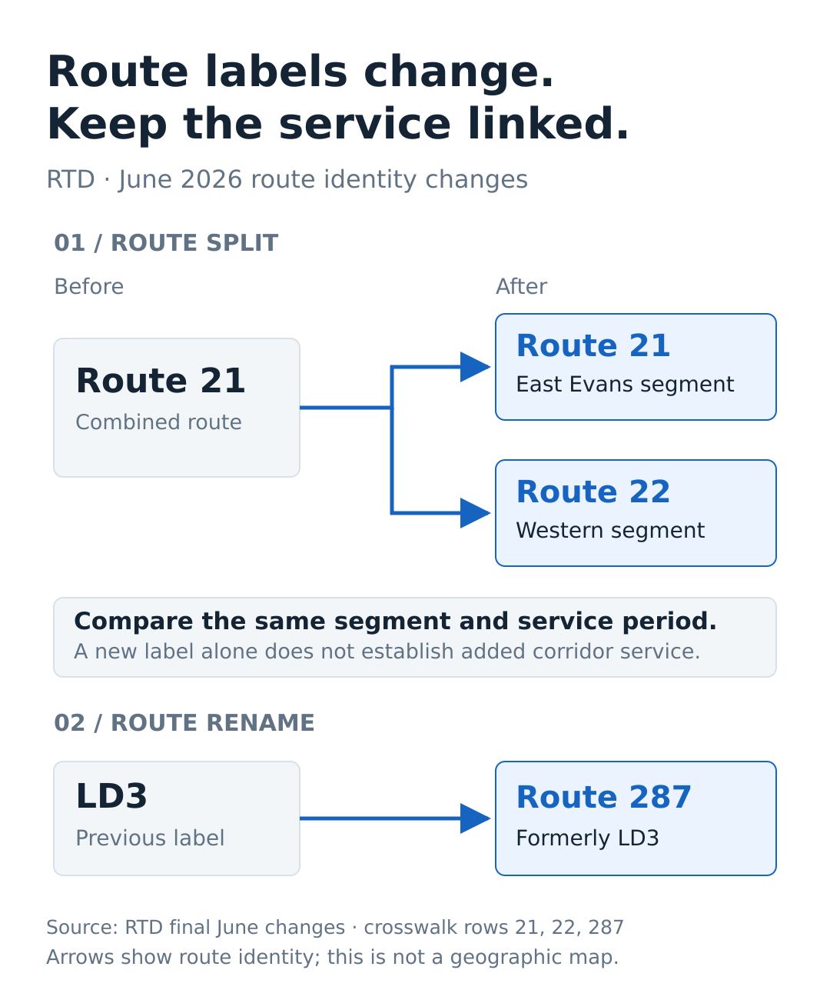

# Transit route identity: a split and a rename

[Download the PNG](route-identity.png) · [Download the SVG](route-identity.svg).

The figure follows three rows in the retained [route-service crosswalk](route-service-crosswalk.csv), based on RTD's [final June 2026 service changes](https://www.rtd-denver.com/service-changes/final-june-26-service-changes), source `SRC-2378`.

| Before | June change | Implication for comparison |
|---|---|---|
| Route 21 | The old route splits into Route 21 serving the East Evans segment and new Route 22 serving the western segment | Compare the same segment and service period. A new identifier alone does not establish added corridor service. |
| LD3 | Renamed Route 287 | Reconcile the alias across source dates before counting or comparing routes. Schedule changes require a separate comparison. |

The arrows show identity links. They are not geographic route geometry, an operated-service result, or an estimate of grant-funded service added. The figure does not count net new routes or infer that a route omitted from a later announcement lost service.

[The generator](../../scripts/supplemental_figures.py) derives the labels from the retained rows and checks the split, western-segment description, rename, and source reference before drawing. The existing [frequency figure](frequency-comparison.md) answers a separate question using the three complete headway pairs.

[Full source and measurement record](README.md).
