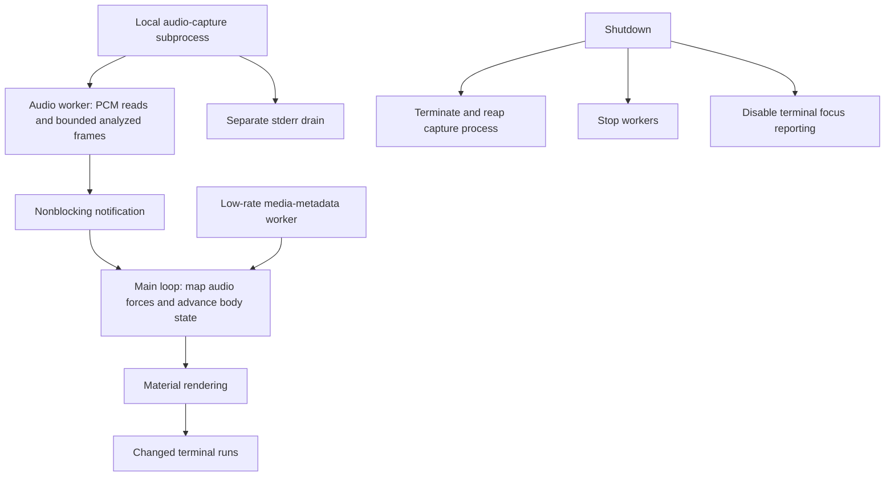

# Lavatune: capture and resource ownership

Tucker directed development through AI coding agents. The supporting engineering example is how capture work reaches the renderer and how those resources stop. [Project account](../../projects/lavatune.md).

The inspected architecture gives the curses loop the main thread, puts capture and metadata polling in separate workers, bounds retained analyzed frames, and drains capture stderr separately. Audio analysis, physical behavior, materials, and terminal writes have distinct owners.

This is a source-based architecture summary. It does not establish a new live audio, performance, or interactive-rendering result.

Public source inspected at revision `f79516e82b9b6383ea1d169be2937c9ba6a5a93d`: [Architecture](https://github.com/tuckeefro/lavatune/blob/f79516e82b9b6383ea1d169be2937c9ba6a5a93d/docs/ARCHITECTURE.md). The [project page](../../projects/lavatune.md) also links the selected audio-source change and its recorded checks.
