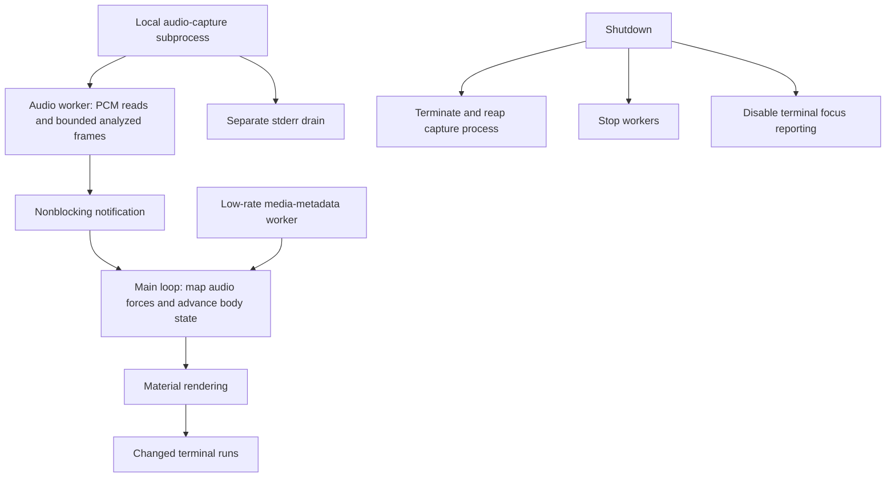

# Lavatune: measured renderer work and resource ownership

Tucker directed development through AI coding agents. The supporting examples show measured renderer work and how capture work reaches the renderer and stops. [Project account](../../projects/lavatune.md).

## Measured renderer comparison

[PNG](renderer-comparison.png) · [SVG](renderer-comparison.svg) · [Raw measurements and environment](renderer-benchmark.json) · [Capture script](../../scripts/measure-lavatune.py).

The unmodified public render benchmark was run five times on one GitHub Actions runner. Each repetition used a fresh process, 120 synthetic frames per path, a target of 120 × 30 terminal cells, and four configured blobs. Bars show medians, dots show each measured run, and whiskers show the observed minimum and maximum. The cost ratio is the median of the five paired scalar-field/contour ratios.

The source script implements distinct paths: scalar-field Fluid uses a 40 × 30 field expanded to the target terminal size; contour Fluid advances bodies at 120 × 30 without that rasterized field and generates occupied spans. These timings compare their body simulation and material-generation work on this host. Live PCM capture, curses calls, terminal presentation, compositor overhead, display cadence, and power consumption are outside this measurement.

The full original script output is retained for every repetition, including its other render paths and cache measurements. The figure selects the two complete Fluid paths; the isolated unchanged-cache result is a different workload. Timing boundaries and measurement order follow the original script, with no added warm-up. This run does not test visual equivalence between paths.

Public source: [original benchmark](https://github.com/tuckeefro/lavatune/blob/f79516e82b9b6383ea1d169be2937c9ba6a5a93d/scripts/benchmark_render.py) · [original performance method and baseline](https://github.com/tuckeefro/lavatune/blob/f79516e82b9b6383ea1d169be2937c9ba6a5a93d/docs/PERFORMANCE.md). The raw record identifies the source revision, Python version, CPU, platform, UTC timestamps, and workflow run. The figure is regenerated from that retained record, while reproducing the measurement is a separate run.

## Capture and shutdown ownership

The inspected architecture gives the curses loop the main thread, puts capture and metadata polling in separate workers, bounds retained analyzed frames, and drains capture stderr separately. Audio analysis, physical behavior, materials, and terminal writes have distinct owners.

The architecture diagram is a source-based summary. The benchmark above separately measures offline renderer work; a new live audio or interactive-rendering result is not established.

Public source inspected at revision `f79516e82b9b6383ea1d169be2937c9ba6a5a93d`: [Architecture](https://github.com/tuckeefro/lavatune/blob/f79516e82b9b6383ea1d169be2937c9ba6a5a93d/docs/ARCHITECTURE.md). The [project page](../../projects/lavatune.md) also links the selected audio-source change and its recorded checks.
