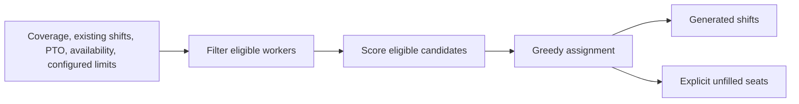

# ShiftForge: constraints and uncovered coverage

This is a retained execution of the actual scheduler with synthetic inputs. Tucker directed application development through AI coding agents. [Project account](../../projects/shiftforge.md).

## Constraint matrix

[Download the PNG](constraint-matrix.png) · [Download the SVG](constraint-matrix.svg).

The matrix is generated from the retained inputs and actual normalized output. Each exclusion names the applicable rest, PTO, or availability condition. Blue cells show generated assignments, and the coverage row shows filled and unfilled seats. Regenerating the figure reads the retained records; it does not rerun the private scheduler.

## Inspect the example

One eight-hour morning shift needs two people on each of March 22 and 23, 2026. Three synthetic workers have equal scoring inputs. The configured minimum rest is ten hours.

| Date | Relevant constraints | Actual generated assignments | Unfilled seats |
|---|---|---|---|
| March 22 | A finished at 23:00 the prior evening, leaving eight hours before the 07:00 start; B has approved PTO | C | 1 |
| March 23 | A has sufficient rest; B's PTO has ended; C is unavailable | A and B | 0 |

The output preserves the shortage rather than assigning a worker excluded by the configured constraints. [Inputs](inputs.json) · [Actual normalized output](output.json).

## Execution record

On October 7, 2026, the original standalone scheduler module and the original scheduler-only QA function were executed in a V8 isolate with CommonJS loading adapted in memory. All **12 existing scheduler assertions passed**. They covered no-worker behavior, manual assignments, approved PTO, consecutive-day limits, rest limits, and manual-assignment validation. [Retained check record](scheduler-checks.json).

Source revision: `96b53ae0285065252eee84250aafd07a037dc8cd`. Optional external PTO and compliance modules were absent. Browser UI, authentication, database access, integrations, and regulatory compliance were not exercised. Shift IDs were omitted from the retained output because they are generated identifiers.

For an authorized local checkout of the private source at that revision, [reproduce.mjs](reproduce.mjs) loads the original scheduler and applies the retained input. The scheduler implementation remains in the private repository.
