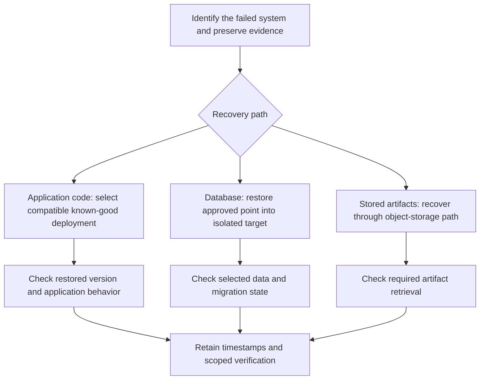

# VanaHR: recovery requirement and evidence

Tucker directed development through AI coding agents and reports setting and validating a 15-minute application/database rollback requirement. [Project account](../../projects/vanahr.md).

A source review on October 7, 2026 inspected the private repository at revision `41a909baa3600fdebf3fa573c14b657211f792d5`. It found a backup/restore/rollback runbook, a restore-fidelity validation procedure, and a retained status note. This summary preserves their distinct measures.

| Measure | Recorded target or account | Evidence available here |
|---|---|---|
| Application/database rollback | Owner-reported requirement: within 15 minutes | The portfolio account; a dated timing record is not included |
| Critical backend/database restoration time | Inspected runbook target: within 60 minutes | A documented recovery objective |
| Recoverable database state loss | Inspected runbook target: no more than 15 minutes | A documented recovery-point objective, distinct from elapsed recovery time |

A code rollback, database restore, and stored-file recovery address different failure classes. The source documents treat these as separate recovery paths.

The retained restore-fidelity status note was last reviewed July 28, 2026. It describes synthetic comparator proof and an operator-reported isolated restore, while leaving a real private source-versus-restored-database PASS unestablished in the retained repository evidence. No production-data operation was run for this portfolio review.

Source documents inspected: `ai/operations/backup_restore_and_rollback_runbook.md`, `docs/operations/restore-fidelity-validation.md`, and `docs/operations/restore-fidelity-evidence-status.md`. Private implementation code, credentials, and customer data are not reproduced.
