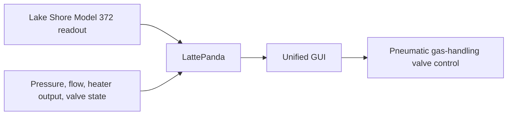
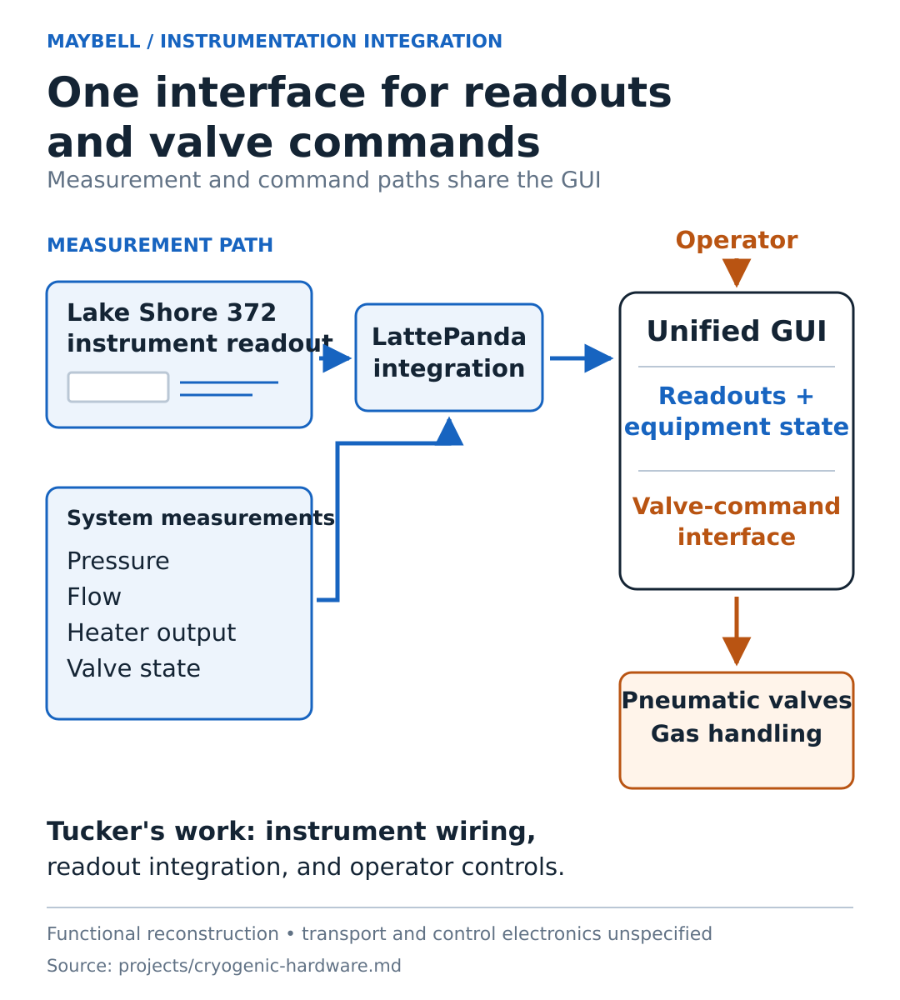

# Maybell Quantum: cryogenic hardware and process development

**Professional work · Mechanical engineering, instrumentation, and manufacturing trials**

At Maybell, I worked on dilution-refrigerator hardware, helium gas handling, instrumentation, tooling, and cryogenic wiring. Three examples connect that work to specific engineering problems.

## Prototype instrumentation and operator controls

As part of the team's refrigeration-prototype work, I set up and wired a Lake Shore Model 372 instrument, integrated its measurement output with a LattePanda board, and combined it with other system measurements in a single GUI.

The GUI combined the Lake Shore readout with pressure-sensor readings, a flow-gauge reading, heater output, and valve state.

It also let operators control pneumatic valves in the gas-handling system.

My contribution connected instrument wiring, readout integration, and the operator interface. Bringing measurements, equipment states, and valve controls into one GUI supported the team's monitoring and operation of the prototype.

The Model 372 is an AC resistance bridge and temperature controller. [Manufacturer description](https://www.lakeshore.com/products/categories/overview/temperature-products/ac-resistance-bridges/model-372-ac-resistance-bridge-temperature-controller).

Functional overview of the measurement integration; wiring details and interface specifications are not shown.

## Cable connector and assembly development

I investigated commercially available connectors and trialed ways to mechanically join connectors to cryogenic ribbon cable. The work balanced component compatibility, material constraints, and repeatable assembly.

## Exploratory CNC welding trials

I tried modifications to improve the straightness of the welding setup used in cable-manufacturing experiments. My main integration work was connecting the welder to the in-house CNC so I could jog its position.

The trials showed that the available setup lacked the precision needed for that phase of the experiment. This work covered adapting equipment and assessing its suitability for the experimental task.

## Supporting instrumentation figure

Reconstructed from this account. Measurements and operator commands are shown separately; wiring and communication details remain unspecified. [Supporting record](../artifacts/cryogenic-hardware/README.md).

## Public technical record

The American Physical Society lists me as presenter and coauthor of **Scalable Flexible Coaxial Ribbon Cables for High-Density Quantum Wiring (Part II)** at the 2023 March Meeting. Its abstract describes laser-welded cable manufacturing and room/cryogenic-temperature characterization. [Read the APS record](https://meetings-archive.aps.org/mar/2023/q72/5/).

The examples above describe my work; the APS record documents the team presentation. Proprietary drawings, process parameters, and internal test records are kept out of this repository.
