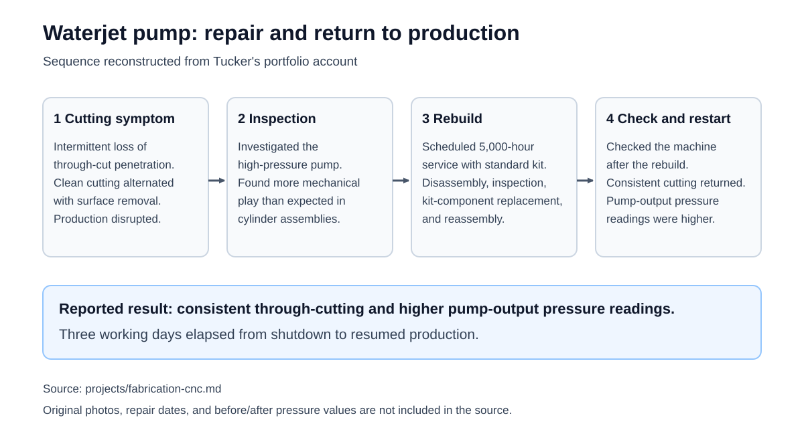

# Fabrication and CNC equipment repair

**Professional work · Custom metal fabrication, shop equipment, and installation**

My fabrication experience includes custom metal projects, design changes for manufacturability and installation, and CNC operation and maintenance. This work includes Raw Creative and Tension Climbing.

## Waterjet high-pressure pump rebuild

### Cutting problem and inspection

A CNC waterjet was intermittently losing cut penetration: it would make a clean through-cut, then remove surface material for roughly an inch without cutting through. The inconsistent cuts were disrupting production.

I investigated the high-pressure pump and found more mechanical play than expected in its cylinder assemblies. I then performed the scheduled 5,000-hour pump rebuild using the standard rebuild kit.

### Repair and return to production

The work involved pump disassembly, inspection, replacement of the internal components covered by the kit, reassembly, and checking the machine after the repair.

Three working days elapsed between shutting the machine down and restarting production. Consistent through-cutting returned, and pressure readings at the pump output were higher after the rebuild.

This is a practical equipment-repair example: moving from symptoms at the cutting process to the equipment supplying it, then carrying the repair through to resumed operation.

## Supporting repair figure

Reconstructed from this account. Timing and results are owner-reported; original repair photos and numerical pressure records are not included. [Supporting record and source status](../artifacts/fabrication-cnc/README.md).
