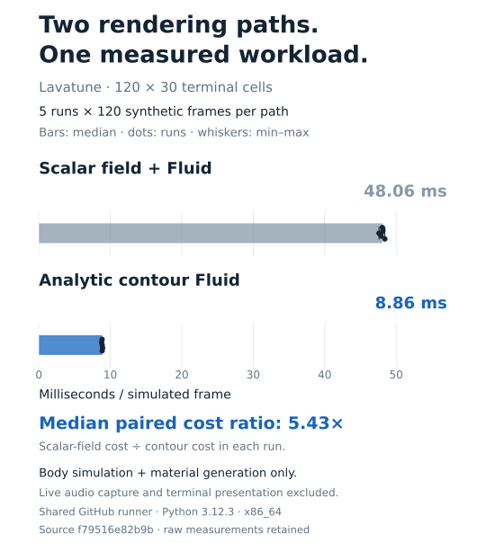

# Lavatune: local audio visualizer

**Independent software experiment · Built by AI coding agents · Python, Linux, and macOS · Alpha**

Lavatune is a local audio-reactive visualizer with terminal and standalone-window modes. It supports different audio-capture paths, diagnostics, and a synthetic demo.

## My role

I directed Lavatune's development through AI coding agents. The agents produced the implementation code.

## Implementation examples

The work goes beyond rendering the animation. Audio capture and window behavior create resource and lifecycle problems: who owns the capture process, how background work stops, how an error is reported, and what remains after the application exits.

The resulting software includes audio-backend contracts, packaging/install behavior, capture-subprocess ownership, descriptor and thread cleanup, signal handling, and cross-platform checks.

## Selected change: audio-source selection and installation

[Merged change #17](https://github.com/tuckeefro/lavatune/pull/17) made backend selection depend on both the operating system and the requested audio source. System-output capture and microphone capture have separate supported paths.

At this change, the supported routes included:

| Platform and source | Behavior |
|---|---|
| Linux system output | Select from PipeWire, PulseAudio, or FFmpeg |
| macOS microphone | Select from FFmpeg or SoX |
| macOS system output | Report that the route is unsupported |

The change also aligned diagnostics with those rules, corrected installation instructions to use the GitHub source, and added regression checks for unsupported combinations and backend selection.

The existing GitHub checks for the change passed across Linux and macOS on Python 3.11–3.13, alongside package-quality checks. Those checks cover code, packaging, and static diagnostics; live microphone permissions and interactive rendering need their own runtime observations. [Recorded checks](https://github.com/tuckeefro/lavatune/actions/runs/33685484316).

The public repository contains the implementation and usage instructions. The README labels the project alpha.

[View the public repository](https://github.com/tuckeefro/lavatune).

## Supporting record

[Measured renderer comparison and capture/resource-ownership diagram](../artifacts/lavatune/README.md).

The chart compares two complete Fluid paths using the original pinned benchmark and retained results. [Inspect the method, source, raw measurements, and scope](../artifacts/lavatune/README.md).
