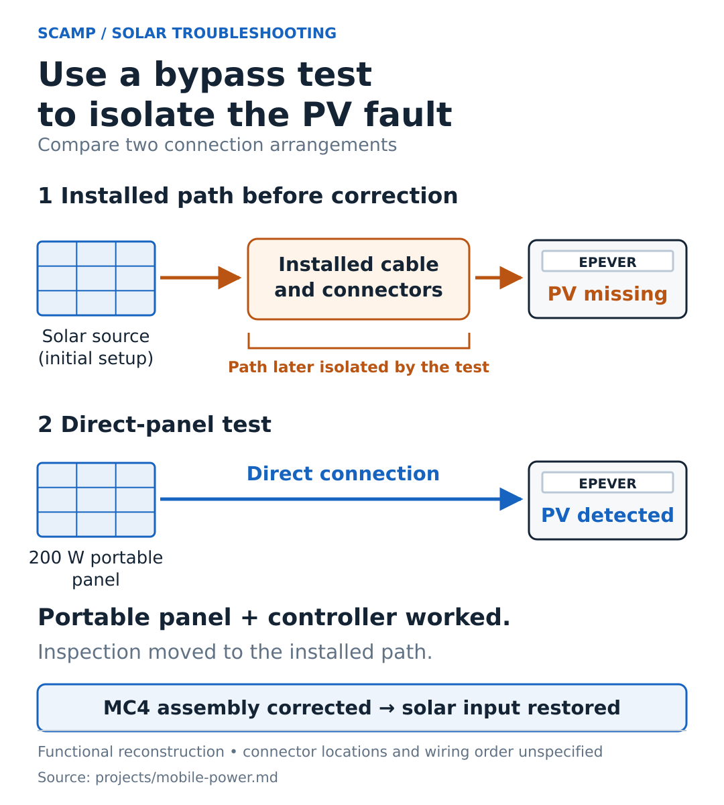
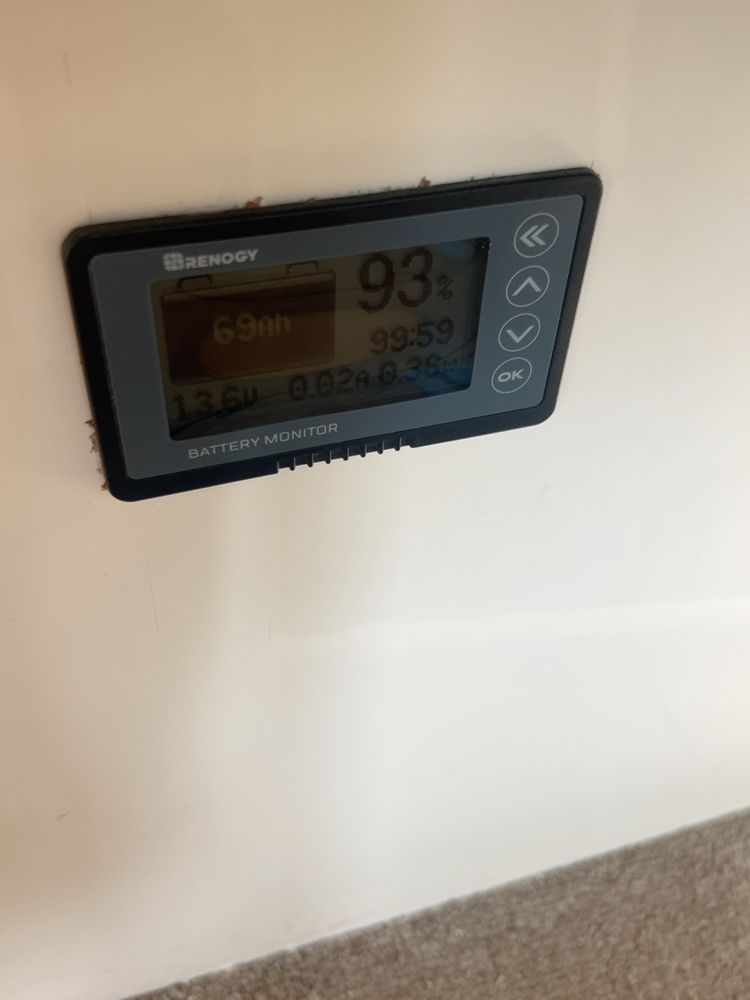

# Mobile RV Power Systems

**Tucker Vana · Independent project · Electrical integration and troubleshooting**

I personally installed and wired the full Sprinter house-power system and the SCAMP solar and battery-shunt monitoring setup. The projects involved fitting charging equipment, battery storage, protection, and monitoring into vehicles with existing electrical systems and limited space.

## Design decision: roof space and cost

The SCAMP had limited roof area for solar. I used a 100 W roof panel and added an affordable 200 W portable panel through an Anderson connector. This expanded the available panel capacity without requiring more roof space. The selection was based on space and cost; I did not calculate a daily load budget before choosing it.

The retrofit uses an EPEVER controller, MC4 branch connectors, a 40 A controller fuse, and a shunt-based battery monitor. The controller's load terminals are unused.

## Troubleshooting: missing solar input

While investigating missing PV input, I found continuity in a cable run. I then connected the 200 W portable panel directly to the controller, which detected the panel in that configuration.

The direct connection narrowed the fault to the installed wiring and connector path. I found an improperly assembled MC4 connector that I had made, corrected it, and restored solar input.

## Second implementation: Sprinter house power

The van manual records two 100 W Renogy panels, a 280 Ah Eco-Worthy lithium battery, charge control, a main breaker, disconnect, bus bars, and fused DC distribution. Its equipment list includes a refrigerator, lights, ventilation fan, diesel heater, and portable power station. The manual also contains vehicle service specifications, inspection notes, and maintenance photos.

## Supporting fault-isolation figure

Reconstructed from the troubleshooting account. [Supporting record](../artifacts/mobile-power/README.md).

## Hardware

The installed monitor displays approximately 13.6 V, 0.02 A, and 93% charge in this photo. Those are display readings, not an independent battery-capacity measurement.

This project illustrates how I work through physical constraints, equipment connections, and faults on installed hardware.
