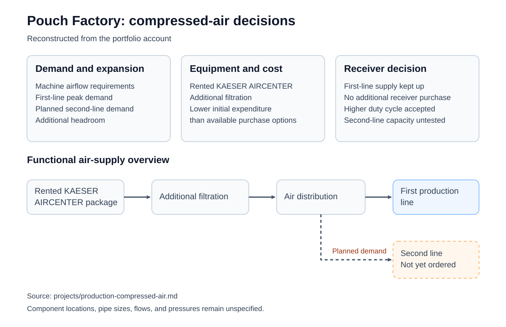
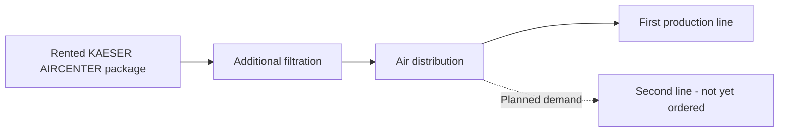

# Pouch Factory: compressed-air system

**Professional work · Production utilities, equipment selection, and integration**

## Starting point

The facility started as a building without the infrastructure needed to run the production line. I developed the air-supply arrangement alongside the layout and equipment installation, with a tight budget, an aggressive schedule, and a small crew.

## My work

- Used machine airflow requirements to establish demand at intended peak line operation.
- Reviewed the air quality available from the compressor package and incorporated additional filtration.
- Selected and integrated a rented KAESER AIRCENTER package, filtration, and distribution.
- Worked on facility plans and P&IDs and carried the design into hands-on line build and operation.

## Design and cost decisions

**Capacity for expansion.** I sized the supply around anticipated demand from two production lines, with additional headroom. Only the first line had arrived; the second had not yet been ordered. The expansion capacity was a design allowance.

**Rental under a constrained budget.** Renting the package required less initial expenditure than the purchase options available to us at the time. It let us obtain the air supply within the startup budget.

**Operating without another receiver.** The supply kept up with the first line without purchasing an additional air receiver. I accepted a higher compressor duty cycle as part of that choice.

[Printable air-supply case sheet](../artifacts/career-sheets/01-air.pdf) · [Case-sheet preview and packet](../artifacts/career-sheets/README.md)

## Supporting decision figure

Reconstructed from this account. The dashed branch marks planned second-line demand; that capacity was not exercised. [Supporting record and source status](../artifacts/production-compressed-air/README.md).

## System scope

Functional overview; the dashed branch represents planned future demand.

## Observed result

During equipment break-in and the initial production run, the air supply kept up with the first line. An additional receiver purchase was unnecessary for that operating load. The planned second-line capacity was not exercised.

This utility work sat within my wider responsibility for facility layout, machinery integration, CAD and calculations, safety plans, operating documents, and technical stakeholder coordination. Facility buildout was still underway during initial production.

[Read the full production-startup account](production-startup.md).
