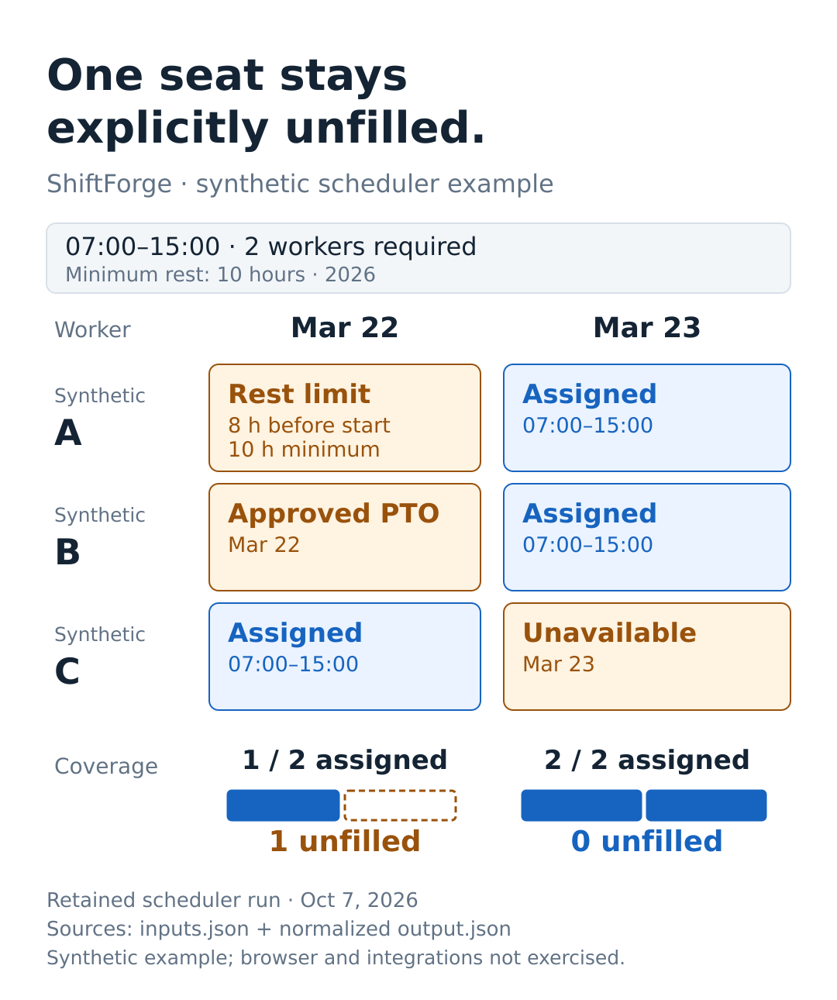

# ShiftForge: coverage scheduling

**Software project · Scheduling rules and application integrations**

ShiftForge explores staff coverage using availability, hours, rest, and consecutive-shift constraints. The application includes role-specific workflows, availability/PTO handling, auto-fill behavior, and organization-scoped access.

## My role

I directed development through AI coding agents. The agents produced the implementation code.

## Implementation scope

The project combines a greedy coverage scheduler with an authenticated labor-data integration. The engineering questions are how constraints are represented, how imported data is normalized, and what happens when the available people cannot satisfy coverage.

This is a scheduling project, without claims of global optimization, regulatory compliance, or live deployment. The source repository is private.

## Supporting record

[Actual synthetic scheduler inputs, output, and 12 passed checks](../artifacts/shiftforge/README.md).

The figure shows the actual normalized output of the retained synthetic example. One required seat remains unfilled. [Inspect the figure, inputs, output, and execution scope](../artifacts/shiftforge/README.md).
